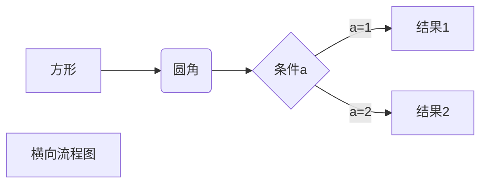
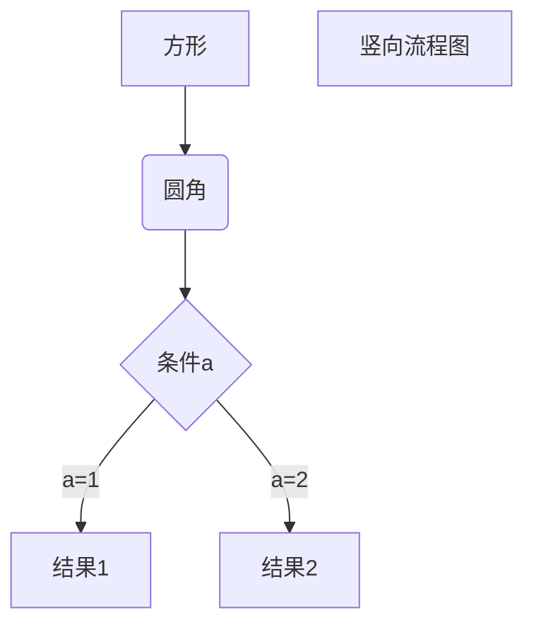
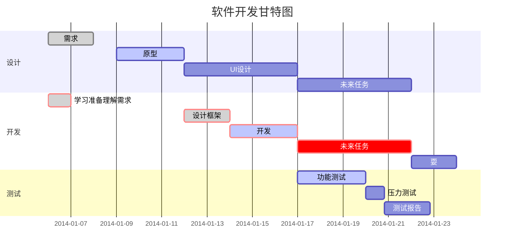

8个Markdown文档进阶写作技巧分享：
- 显示特殊符号
- 添加emoji表情符号🥰
- 添加字体字号
- 添加字体颜色和修改字体大小
- 添加文字背景色
- 添加 Todo 列表
- 添加常用数学公式
- 添加流程图、时序图和甘特图
- 添加注意事项


## 显示特殊符号

- [SYMBL](https://symbl.cc/cn/) - 特殊字符对应的Unicode码查询
- 语法符号，前面加反斜线\即可显示符号本身，例如：

```markdown
\\ 反斜杠
\* 星号
\_ 下划线
\{\} 括号
\# 井号
\+ 加号
\- 减号
\! 感叹号
```

演示：

\\ 反斜杠
\* 星号
\_ 下划线
\{\} 括号
\# 井号
\+ 加号
\- 减号
\! 感叹号

## 添加emoji表情符号🥰

- [Emoji Cheat Sheet](https://www.webfx.com/tools/emoji-cheat-sheet/) - 给你的Markdown文档添加表情🍁
- 去上面的网站即可复制粘贴，需要的表情包🤔

## 添加字体字号

有时侯我们需要修改文字的字体字号，可是我们就会简单的“加粗”“斜体”等，这样子一来又觉得有点单调。<br>其实我们可以用HTML代码来改变Markdown文档的字体字号：

- [CSS字体](https://www.jb51.net/css/67658.html) - 让你的Markdown文档有更多的字体
- 通过上面的网站查询到的字体名字 `<font style="font-family:写入到这里"></font>`

```html
<font style="font-family: STKaiti;">我是华文楷体</font>
<font style="font-family: STCaiyun;">我是华文彩云体</font>
<font style="font-family: STXingkai;">我是华文行楷</font>
```

演示：

<font style="font-family: STKaiti;">我是华文楷体</font><br>
<font style="font-family: STCaiyun;">我是华文彩云体</font><br>
<font style="font-family: STXingkai;">我是华文行楷</font>

## 添加字体颜色和修改字体大小

通过上面的学习你已经会使用HTML代码来改变Markdown文档的字体字号，同样Markdown文档也是可以通过HTML代码实现字体颜色：

- [CSS颜色](http://xh.5156edu.com/page/z1015m9220j18754.html) - 让你的Markdown文档字体有更多的颜色
- 通过上面查询到的颜色编码 `<font color="写入到这里" size="写入数值改变字体大小"></font>`

```html
<font color=LightSkyBlue size=72>亮天蓝色</font>
<font color=SpringGreen size=42>春绿色</font>
<font color=Red size=6>纯红色</font>
```

演示：

<font color=LightSkyBlue size=72>亮天蓝色</font>

<font color=SpringGreen size=42>春绿色</font>

<font color=Red size=6>纯红色</font>

## 添加文字背景色

Markdown本身不支持背景色设置，需要采用内置html的方式实现。<br>借助 table, tr, td 等表格标签的 bgcolor 属性来实现背景色的功能。例如：

- [CSS颜色](http://xh.5156edu.com/page/z1015m9220j18754.html) - 让你的Markdown文档字体有更多的颜色
- 通过上面查询到的颜色编码 `<table><tr><td bgcolor="写入到这里"></td></tr></table>`

```html
<table><tr><td bgcolor=LightSkyBlue>背景色是：亮天蓝色</td></tr></table>
<table><tr><td bgcolor=SpringGreen>背景色是：春绿色</td></tr></table>
<table><tr><td bgcolor=Red>背景色是：纯红色</td></tr></table>
```

演示：

<table><tr><td bgcolor=LightSkyBlue>背景色是：亮天蓝色</td></tr></table>
<table><tr><td bgcolor=SpringGreen>背景色是：春绿色</td></tr></table>
<table><tr><td bgcolor=Red>背景色是：纯红色</td></tr></table>

## 添加 Todo 列表

- 使用 - [ ] 和 - [x] 语法可以创建复选框，实现 todo-list 等功能
- 输入顺序：- 空格 [ 空格 ] 空格 

```markdown
- [ ] 未选中状态
- [x] 选中状态
```

演示：

- [ ] 未选中状态

- [x] 选中状态

## 添加常用数学公式

- [数学公式](https://blog.csdn.net/mingzhuo_126/article/details/82722455) - 让你的Markdown文档添加公式

- 公式块 ，输入美元符（$）然后回车，中间输入相应代码，详细代码参考上方网站。例如：

```markdown
$$
\sin x =2  \sin x \cos
$$

$$
e^{i\pi} + 1 = 0
$$

$$
\begin{Bmatrix}
   a & b \\
   c & d
\end{Bmatrix}
$$
```

演示：

$$
\sin x =2  \sin x \cos
$$

$$
e^{i\pi} + 1 = 0
$$

$$
\begin{Bmatrix}
   a & b \\
   c & d
\end{Bmatrix}
$$

## 添加流程图、时序图和甘特图

### 横向流程图

例如：



演示：

<pre class="mermaid">
graph LR
A[方形] -->B(圆角)
    B --> C{条件a}
    C -->|a=1| D[结果1]
    C -->|a=2| E[结果2]
    F[横向流程图]
</pre>

### 竖向流程图

例如：



演示：

<pre class="mermaid">
graph TD
A[方形] --> B(圆角)
    B --> C{条件a}
    C --> |a=1| D[结果1]
    C --> |a=2| E[结果2]
    F[竖向流程图]
</pre>

### UML时序图

例如：

```sequence
对象A->对象B: 对象B你好吗?（请求）
Note right of 对象B: 对象B的描述
Note left of 对象A: 对象A的描述(提示)
对象B-->对象A: 我很好(响应)
对象A->对象B: 你真的好吗？
```

演示：

<pre class="mermaid">
sequenceDiagram
  对象A->对象B: 对象B你好吗?（请求）
  Note right of 对象B: 对象B的描述
  Note left of 对象A: 对象A的描述(提示)
  对象B-->对象A: 我很好(响应)
  对象A->对象B: 你真的好吗？
</pre>

### UML复杂时序图

例如：

```sequence
Title: 标题：复杂使用
对象A->对象B: 对象B你好吗?（请求）
Note right of 对象B: 对象B的描述
Note left of 对象A: 对象A的描述(提示)
对象B-->对象A: 我很好(响应)
对象B->小三: 你好吗
小三-->>对象A: 对象B找我了
对象A->对象B: 你真的好吗？
Note over 小三,对象B: 我们是朋友
participant C
Note right of C: 没人陪我玩
```

演示：

<pre class="mermaid">
sequenceDiagram
  Title: 标题：复杂使用
  对象A->对象B: 对象B你好吗?（请求）
  Note right of 对象B: 对象B的描述
  Note left of 对象A: 对象A的描述(提示)
  对象B-->对象A: 我很好(响应)
  对象B->小三: 你好吗
  小三-->>对象A: 对象B找我了
  对象A->对象B: 你真的好吗？
  Note over 小三,对象B: 我们是朋友
  participant C
  Note right of C: 没人陪我玩
</pre>

### 甘特图

例如：



演示：

<pre class="mermaid">
%% 语法示例
        gantt
        dateFormat  YYYY-MM-DD
        title 软件开发甘特图
        section 设计
        需求                      :done,    des1, 2014-01-06,2014-01-08
        原型                      :active,  des2, 2014-01-09, 3d
        UI设计                     :         des3, after des2, 5d
    未来任务                     :         des4, after des3, 5d
        section 开发
        学习准备理解需求                      :crit, done, 2014-01-06,24h
        设计框架                             :crit, done, after des2, 2d
        开发                                 :crit, active, 3d
        未来任务                              :crit, 5d
        耍                                   :2d
        section 测试
        功能测试                              :active, a1, after des3, 3d
        压力测试                               :after a1  , 20h
        测试报告                               : 48h
</pre>

## 添加注意事项

- 输入三个反单引号 ``` 再输入 notice 回车即可输入注意事项，例如：

````markdown
```notice
这个是一个注意事项
```
````

演示：

```notice
这个是一个注意事项
```

<br>

-----

参考文章：

- [Markdown - 菜鸟教程](https://www.runoob.com/markdown/md-advance.html)
